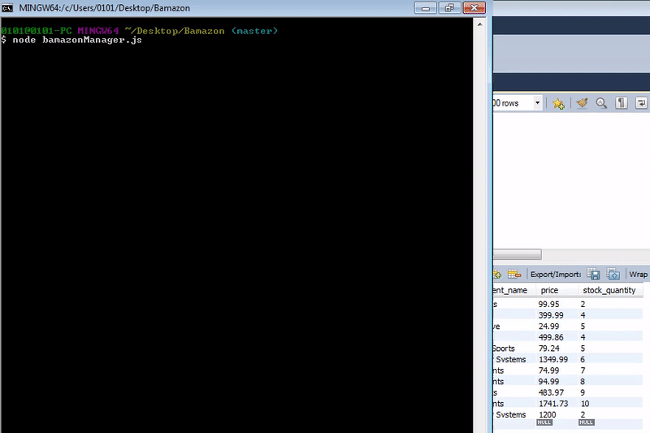
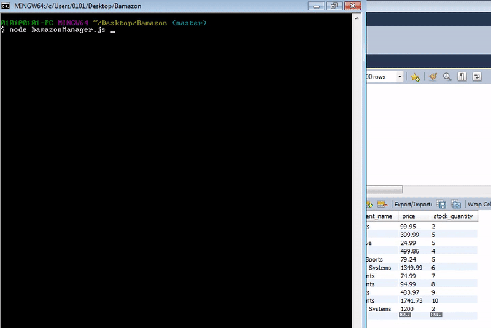

# Bamazon

## Brief Description

This application uses a simple command line based storefront using npm modules like [inquirer](https://www.npmjs.com/package/inquirer) and the [mysql](https://www.npmjs.com/package/mysql) database package. The application presents two interfaces: **Customer** and **Manager**

### MySQL Database Setup

In order to run this application, you should have the MySQL database already set up on your machine. If you don't, visit the [MySQL installation page](https://dev.mysql.com/doc/refman/5.6/en/installing.html) to install the version you need for your operating system. 
Once you have MySQL isntalled, you will be able to create the *bamazon* database and the *products* table with the SQL code found in [products_table.sql](products_table.sql). Run this code inside your MySQL client to populate the database, then you will be ready to proceed with running the Bamazon Customer and Manager interfaces.

### Customer Interface

To run the customer interface please type the following lines on the terminal (e.g. Git Bash, etc)

	npm install
	node bamazonCustomer.js

The customer interface allows the user to view the current list of store items for sale, which also includes the corresponding item IDs, item Name, department and price. The user is then able to purchase one of the existing items by entering the item ID and the desired quantity. 
If the selected quantity is currently in stock, the user's order is fulfilled, displaying the total purchase price and updating the store database. If the desired quantity is not available, the user is prompted with an insufficient stock message and the order will not go through.

### Manager Interace

To run the manager interface please type the following lines on the terminal (e.g. Git Bash, etc)

	npm install
	node bamazonManager.js

The manager interface presents a list of four options, shown below. 

	? Please select an option: (Use arrow keys)
	❯ View Products for Sale 
	  View Low Inventory 
	  Add to Inventory 
	  Add New Product
	  
The **View Products for Sale** option allows the user to view the current inventory of store items: item IDs, descriptions, department in which the item is located, price, and the quantity available in stock.

The **View Low Inventory** option shows the user the items which currently have fewer than 100 units available.

The **Add to Inventory** option allows the user to select a given item ID and add additional inventory to the target item.

The **Add New Product** option allows the user to enter details about a new product which will be entered into the database upon completion of the form.

